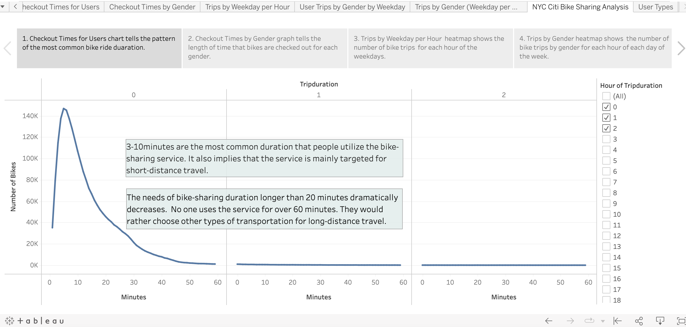
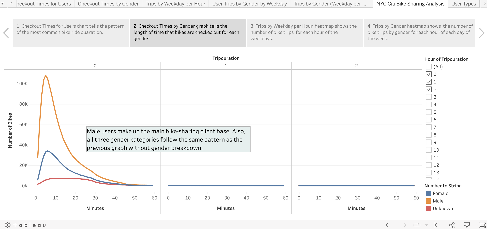
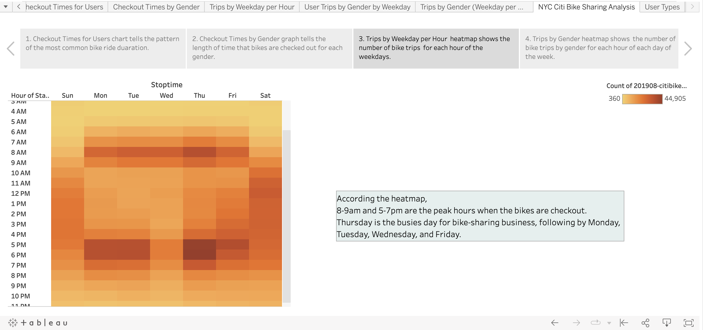
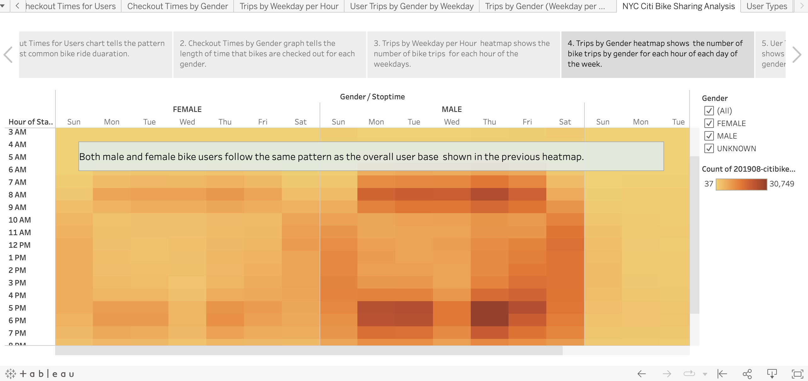
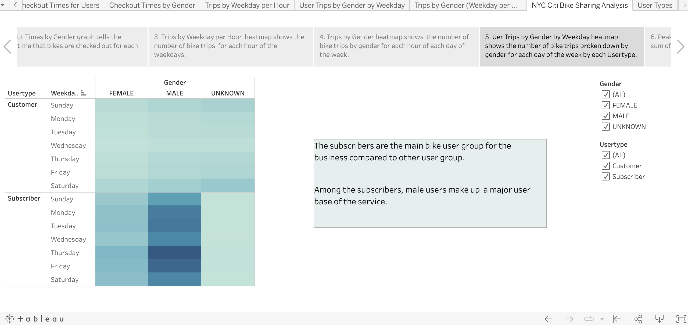
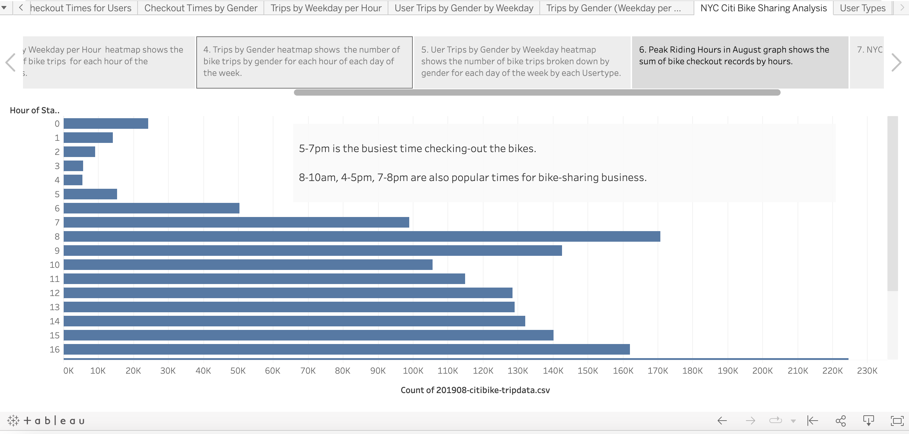
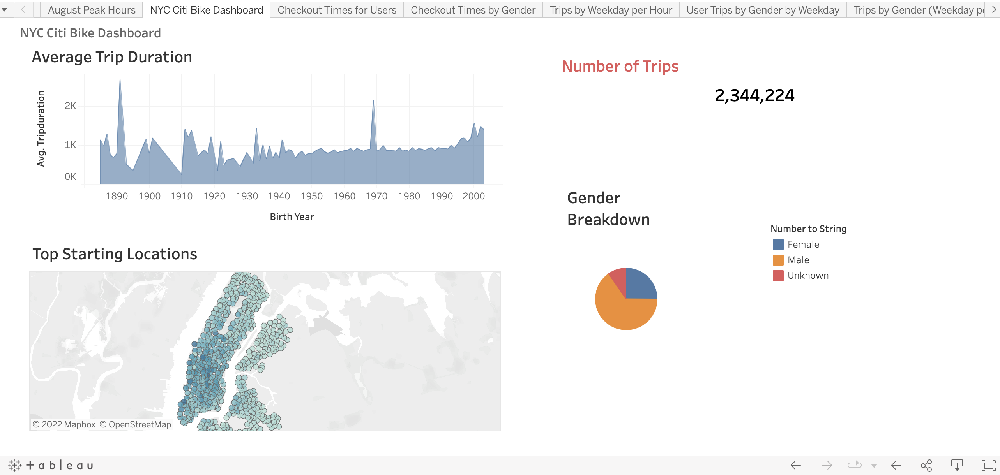
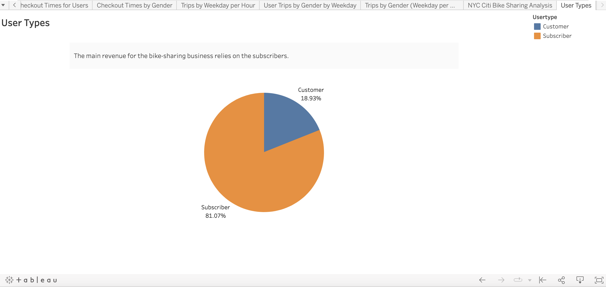

# bikesharing
## Overview of the project
The purpose of the project is to analyze the NYC bikesharing data in August 2019 by creating analytic dashboards and a set of visual story for a business proposal. The analysis would help the investors with the decision-making process of a bike-sharing program in Des Moines, Iowa. The visual story will  
* Show the length of time that bikes are checked out for all riders and genders
* Show the number of bike trips for all riders and genders for each hour of each day of the week
* Show the number of bike trips for each type of user and gender for each day of the week.

[***Click to check out the full Tableau story***](https://public.tableau.com/app/profile/lily.han3705/viz/NYC_Bikesharing_16632153757280/UserTypes?publish=yes)

## Results
#### 1. Checkout Times for Users

#### 2. Checkout Times by Gender

#### 3. Trips by Weekday per Hour

#### 4. Trips by Gender

#### 5. User Trips by Gender by Weekday

#### 6. August Peak Hours

#### 7. Citi Bike Dashboard
The dashboard provides a holistic picture of the performance of the NYC citi bike sharing business in August with the facts and visulizations: 

## Summary
The data analysis of NYC Citibike sharing business in August 2019 provides insightful information for investors who'd like to implement the program in Des Moines, Iowa. 
* The number of trips (2,344,224) shows there is a huge market demand of shared-bike for short distance travel.  
* Male users and subscribers are the primary clients of the NYC Citibikes sharing business. 
* More bikes are checked out during rush hours on weekdays. Thursday is the busiest day for bike-sharing business.   

In order to provide more reference informaton for the city of Des Moines, we could conduct further analysis on the number of shared-bikes put in use in NYC, the least checkout time slots for bike maintenance, or the percentage of different user types. 
